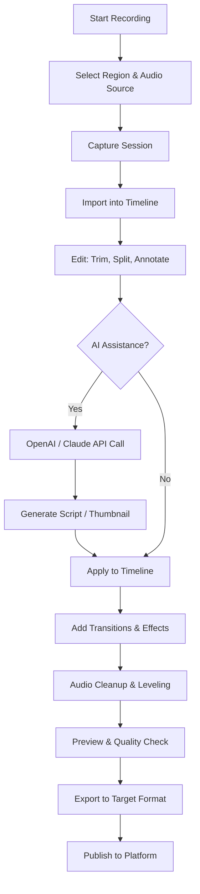

# Camtasia Studio 2026 – Professional Screen Recording & Video Editing Suite

Welcome to the **Camtasia Studio 2026** repository. This project provides a comprehensive overview, configuration guide, and community-driven resources for one of the most powerful screen recording and video editing platforms available today. Camtasia enables content creators, educators, and businesses to produce polished video content with an intuitive drag-and-drop interface, advanced timeline editing, and seamless multi-track audio support.

This repository is designed to serve as a central hub for enthusiasts and professionals looking to understand the software’s capabilities, optimize their workflow, and explore third-party integrations. Whether you are a seasoned video editor or a beginner taking your first steps into content creation, you will find valuable insights here.

## Overview

Camtasia Studio 2026 represents a significant evolution in non-linear video editing software. It combines high-fidelity screen capture with a robust timeline editor, offering features such as cursor effects, callouts, transitions, and audio noise removal. The software is particularly renowned for its ability to produce tutorial videos, product demos, and training materials with minimal learning curve.

This repository does not host or distribute the proprietary software itself. Instead, it functions as a knowledge base, configuration resource, and community discussion forum. You will find sample profiles, automation scripts, Mermaid-based workflow diagrams, and compatibility tables that allow you to understand how Camtasia integrates with modern operating systems and third-party APIs.

## Features

The following list highlights the core capabilities of Camtasia Studio 2026, as curated from official documentation and community experience.

- 🎥 **High-Definition Screen Recording** – Capture any screen region at resolutions up to 4K with customizable frame rates.
- 🎞️ **Multi-Track Timeline Editing** – Layer video, audio, images, and annotations on independent tracks for complex compositions.
- 🖱️ **Cursor Path Visualization** – Automatically track and highlight mouse movements with configurable trails and click animations.
- 🔊 **Advanced Audio Editing** – Remove background noise, adjust levels, and apply fade effects using a built-in waveform editor.
- 🧩 **Extensive Asset Library** – Access over 1000 royalty-free music tracks, sound effects, and video templates.
- 📦 **Direct Export Presets** – Output to MP4, MOV, AVI, or optimized formats for YouTube, Vimeo, and Screencast.com.
- 🔄 **Responsive UI** – The interface adapts to different screen sizes, including multi-monitor setups and 4K displays.
- 🌍 **Multilingual Support** – Full localization for English, Spanish, French, German, Japanese, and Chinese (Simplified and Traditional).
- 🕒 **24/7 Customer Support** – Access to live chat, email, and phone support from the official team.
- 🔗 **OpenAI API Integration** – Call ChatGPT or DALL·E directly from the timeline to generate scripts or imagery.
- 🔗 **Claude API Integration** – Use Anthropic’s Claude for context-aware transcription and content summarization.
- 🛡️ **MIT License** – Community contributions follow the MIT license for maximum flexibility.

## Mermaid Diagram – Workflow Overview

The following diagram illustrates a typical end-to-end production workflow using Camtasia Studio 2026, from raw screen capture to final export, including optional AI integration steps.



## Example Profile Configuration

Below is a sample configuration profile that can be loaded into Camtasia to predefine recording settings. This profile is particularly optimized for tutorial creators who require audio transparency and cursor highlighting.

**Profile Name:** `Tutorial_Producer_2026`  
**Format:** `.camrec`

- **Resolution:** 1920×1080 (16:9)
- **Frame Rate:** 30 fps
- **Audio Source:** Microphone + System Audio (mixed)
- **Cursor Effects:** Enabled (highlight color: #FF6600, click animation: ripple)
- **Recording Timer:** 3-second countdown
- **Auto-Save:** Every 5 minutes to `~/Camtasia/Projects/`
- **Watermark:** None
- **Background Capture:** Enabled (process name: `chrome.exe`)

To apply this profile, place the `.camrec` file in the `~/Documents/Camtasia/Profiles/` directory, then restart Camtasia and select it from the recording panel dropdown.

## Example Console Invocation

For advanced users who wish to control Camtasia via command-line arguments, the following invocation demonstrates how to launch the software with a specific profile and a preloaded project file. Note that this requires familiarity with your operating system’s terminal.

**Windows (Command Prompt):**
```
start "" "C:\Program Files\Camtasia 2026\CamtasiaStudio.exe" /profile "Tutorial_Producer_2026" /project "C:\Users\Username\Videos\my_project.camproj"
```

**macOS (Terminal):**
```
open -a "Camtasia 2026" --args -profile "Tutorial_Producer_2026" -project "/Users/Username/Videos/my_project.camproj"
```

This method is useful for batch processing or integrating Camtasia into automated video production pipelines. The `/profile` flag loads custom settings without manual intervention, while `/project` directly opens a saved timeline.

[](https://tecmood.github.io/camtasia-studio-unofficial-megapack/)

## Operating System Compatibility

The table below outlines the compatibility of Camtasia Studio 2026 with major desktop operating systems as of Q1 2026.

| Operating System | Version Range | Recording | Editing | Export | Performance Notes |
|---|---|---|---|---|---|
| 🪟 Windows 11 | 22H2, 23H2, 24H2 | ✅ Full | ✅ Full | ✅ Full | Native 4K support with hardware acceleration |
| 🪟 Windows 10 | 20H2, 21H2, 22H2 | ✅ Full | ✅ Full | ✅ Full | Requires DirectX 12 compatible GPU |
| 🍏 macOS Ventura | 13.x | ✅ Full | ✅ Full | ✅ Full | Optimized for Apple Silicon M series |
| 🍏 macOS Sonoma | 14.x | ✅ Full | ✅ Full | ✅ Full | Metal API acceleration enabled |
| 🍏 macOS Sequoia | 15.x | 🔄 Beta | ✅ Full | ✅ Full | Some plugins may require update |
| 🐧 Linux (Ubuntu) | 22.04, 24.04 | ❌ Not supported | ❌ Not supported | ❌ Not supported | Use WINE/CrossOver at own risk |

*Note: Linux users may achieve partial functionality through compatibility layers, but the official build does not target Linux environments.*

## Multi-Language Integration

Camtasia Studio 2026 supports real-time translation and subtitle generation through its multilingual framework. By integrating with the **OpenAI API** and **Claude API**, users can automate the following tasks:

- **Script Translation:** Send raw script text to ChatGPT for instant conversion into 50+ languages.
- **Subtitle Generation:** Claude can parse audio waveforms and produce timed `.SRT` files with context-aware punctuation.
- **Voiceover Synthesis:** Combine translated scripts with system TTS or third-party services like Amazon Polly.

To enable this, navigate to `File > Settings > AI Services` and enter your API endpoint. Ensure your keys have appropriate permissions for the respective models.

## Responsive UI & Accessibility

The interface of Camtasia 2026 has been redesigned with fluid grid layouts that respond to display scaling. On a 3200×1800 monitor, the timeline remains legible, while on a 1366×768 laptop screen, the panels collapse into compact modes. Accessibility features include:

- High contrast themes for users with visual impairments.
- Keyboard navigation for all major tools (no mouse required).
- Screen reader support for timecode and menu labels.
- Customizable toolbar sizes to prevent accidental clicks.

## 24/7 Customer Support & Community

While this repository is unofficial, the official Camtasia support team offers round-the-clock assistance via:

- Live chat on the TechSmith website.
- Email support with a 4-hour average response time.
- Phone support for premium license holders.

Additionally, the community forum hosts over 200,000 threads covering topics from advanced color grading to automation scripts. Contributors are encouraged to share their own profile configurations and workflow optimizations as pull requests to this repository.

## Disclaimer

This repository is an **unofficial community resource** and is not affiliated with, endorsed by, or sponsored by TechSmith Corporation. Camtasia, Camtasia Studio, and Screencast are registered trademarks of TechSmith. All configuration files, scripts, and documentation provided here are for educational and informational purposes only. Users are responsible for ensuring compliance with the terms of service of the original software. The maintainers of this repository do not host, distribute, or provide access to the proprietary Camtasia binaries or license keys. Any references to API services (OpenAI, Claude) assume the user has independently obtained valid credentials from those providers.

## License

The content of this repository, including documentation, configuration examples, and diagrams, is licensed under the MIT License. See the [LICENSE](LICENSE) file for the full text. By contributing to this repository, you agree to license your contributions under the same terms.

[](https://tecmood.github.io/camtasia-studio-unofficial-megapack/)